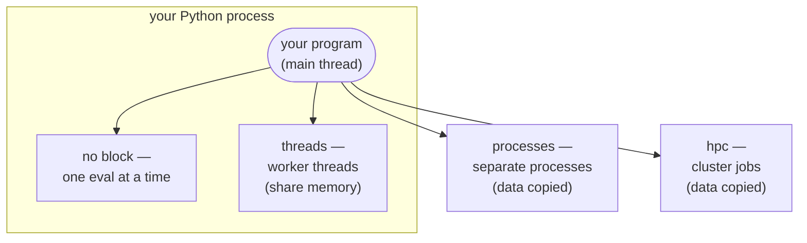

# Running in Parallel

An optimization calls your objective function many times. By default these calls
happen one after another, on the same thread that called
[`optimize`][ropt.simple.optimize]. If each call is slow, you can run several at
the same time by opening an **execution block** first.

There are three kinds of block. You pick one with a `with` statement, and every
optimization inside it uses that block:

```python
from ropt.simple import optimize, threads

with threads(workers=4):
    result = optimize(config, x0, objective)
```

The block fixes one worker pool for everything inside it. You cannot open a
second block inside the first one.

Where your objective runs depends on which block you open (or none):



Threads stay **inside** your Python process and share its memory, so any Python
function works and nothing is copied. `processes` and `hpc` run the work
**outside** your process, so the objective and its data are copied there.

??? info "New to threads and processes?"
    A **process** is a running program with its own private memory. A **thread**
    is a worker inside a process, and all threads in a process share that memory.
    Threads are cheap and share data for free, but Python runs only one thread's
    code at a time, so threads do not speed up pure computation — only work that
    waits (for a file, a network reply, an external tool). Separate **processes**
    each have their own interpreter and run truly in parallel, but they do not
    share memory, so data has to be copied between them.

## The three choices

### `threads` — a pool of threads in the same process

```python
from ropt.simple import threads
```

The evaluations run on background **threads**, all inside your program. Nothing
is copied between them, so any Python function works as the objective, and it can
freely use the data around it.

Use `threads` when each evaluation spends most of its time **waiting** — for
example when it starts an external program, reads a file, or calls a network
service. While one evaluation waits, the others can run.

Threads share one Python interpreter. Because of this, threads do **not** speed
up work that is pure Python number-crunching. For that, use `processes`.

### `processes` — a pool of separate processes

```python
from ropt.simple import processes
```

The evaluations run in **separate processes**. This gives real parallel speed for
heavy Python computations, because each process has its own interpreter.

Your objective and its data are **copied** to the worker processes, which
currently requires the `cloudpickle` extra (see
[Installation](installation.md#optional-extras)).

Because each worker is a separate process, your objective can only send results
**back** through its return value; it cannot share memory with your handlers or
the rest of your program. See
[Handlers and the process boundary](../running/running.md#handlers-and-the-process-boundary).

### `hpc` — a pool of jobs on a cluster

```python
from ropt.simple import hpc
```

The evaluations are submitted as jobs to an HPC queue (for example Slurm). Use
this when a single evaluation is a large job that belongs on a cluster. It needs
the `ropt[hpc]` extra and a reachable cluster:

```python
with hpc(workers=10):
    result = optimize(config, x0, objective)
```

With no further arguments, `hpc` uses the default cluster and queue from the
`pysqa` configuration of your `ropt` installation. Cluster-specific parameters —
such as the `cluster` name, the `queue`, and the number of `cores` per job — can
be passed to `hpc` when you need them; see
[Running Optimizations](../running/running.md#running-on-an-hpc-cluster) for the full list.

Like `processes`, the work is copied to the cluster. This currently uses
`cloudpickle`, which is included in the `ropt[hpc]` extra (see
[Installation](installation.md#optional-extras)).

## Which one should I use?

| Block | Where evaluations run | Data | Speeds up heavy Python? | Use when |
| --- | --- | --- | --- | --- |
| none (default) | the main thread, one at a time | shared | no | evaluations are fast |
| `threads` | background threads, one process | shared | no — one interpreter | each evaluation mostly **waits** (external tool, I/O) |
| `processes` | separate processes | copied | yes | each evaluation is heavy **Python computation** |
| `hpc` | jobs on a cluster | copied | yes | each evaluation is a big **cluster job** |

## Running multiple optimizations in parallel

The same blocks also power [`optimize_many`][ropt.simple.optimize_many], which
runs several optimizations at once:

```python
from ropt.simple import optimize_many, threads

with threads(workers=4):
    results = optimize_many(config, start_points, objective)
```

`optimize_many` always runs the optimizations themselves concurrently, each on
its own thread — that part does not depend on the block. The block instead
decides how the *function evaluations* inside those runs are parallelized: they
share its one worker pool. So `threads(workers=1)` runs the optimizations
together but evaluates one point at a time, while a larger pool (or `processes`
or `hpc`) evaluates several at once. An execution block is required.

See [Running Optimizations](../running/running.md#many-optimizations-at-once) for more.

## Offloading your own functions

A block can also run **your own** functions in parallel, not just the optimizer's
evaluations. Pass a function — or several — to [`offload`][ropt.simple.offload]
and it runs on the same pool:

```python
from functools import partial

from ropt.simple import offload, processes

with processes(workers=4):
    result = offload(partial(expensive, data))
```

This is for expensive, self-contained work in code you write — a helper, a custom
step, or a transform. Like the objective, such functions are copied to the
workers under `processes`/`hpc`. See
[Running Optimizations](../running/running.md#offloading-your-own-work) for
details.
