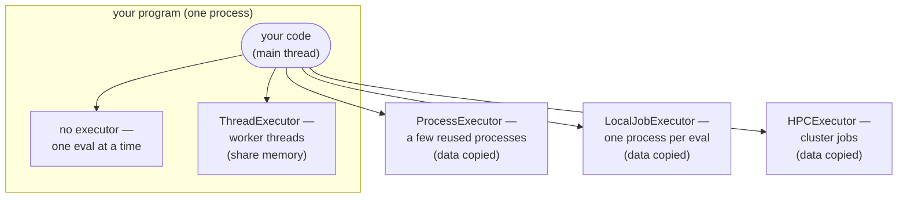

# Running in Parallel

An optimization calls your evaluation function many times. By default these calls
happen one after another, on the same thread that called
[`optimize`][ropt.simple.optimize]. If each call is slow, you can run several at
the same time by evaluating on an **executor**.

Build one with a `with` statement and pass it to the run:

```python
from ropt.simple import ThreadExecutor, optimize

with ThreadExecutor(workers=4) as executor:
    result = optimize(config, x0, objective, executor=executor)
```

That is the whole pattern. You can build as many executors as you like, of any
kind, and each run uses the one you give it — and only that one. Leaving the
`with` block releases its workers. The runnable script is
[examples/simple/parallel.py](https://github.com/TNO-ropt/ropt/blob/main/examples/simple/parallel.py),
which evaluates one optimization on a thread executor, or on a process executor
when it is passed `--multiprocessing`.

Where your objective runs depends on which executor you pass (or none):



Threads stay **inside** your program and share its memory, so any Python
function works and nothing is copied. The other three run the work **outside**
it, so the objective and its data are copied there.

Only the evaluations ever leave. The optimizer itself, the executor object and
your handlers all stay put, whichever executor you choose. Below, **your
program** always means that one process — the one that built the executor and
called `optimize`.

??? info "New to threads and processes?"
    A **process** is a running program with its own private memory. A **thread**
    is a worker inside a process, and all threads in a process share that memory.
    Threads are cheap and share data for free, but Python runs only one thread's
    *Python* code at a time. Work that **waits** — for a file, a network reply,
    an external tool — overlaps freely, because a waiting thread is not running
    Python code; and so does work a library performs outside Python, as `numpy`
    does while it works on an array. What is stuck one-at-a-time is arithmetic
    written in Python itself. Separate **processes** each have their own
    interpreter and always run truly in parallel, but they do not share memory,
    so data has to be copied between them, and starting one takes noticeably
    longer than starting a thread. A process also need not be on this machine:
    an `HPCExecutor` runs each evaluation as a job on a cluster, which is the
    same arrangement spread over more machines.

## The four choices

Passing no executor evaluates in place, so there are four:

| Executor | Evaluations run | Data | Applies when |
| --- | --- | --- | --- |
| none | on the calling thread, one at a time | shared | evaluations are fast — this is the default |
| `ThreadExecutor` | on background threads in your program | shared | each evaluation mostly **waits**: an external tool, a file, a network call |
| `ProcessExecutor` | in a few reused processes | copied | each evaluation is heavy **Python computation** |
| `LocalJobExecutor` | in one fresh process per evaluation | copied | each evaluation is a self-contained **job** on this machine |
| `HPCExecutor` | as jobs on a cluster queue | copied | each evaluation is a large **cluster job** |

An executor costs something to set up and to hand work to. Below a certain
evaluation cost, that setup is all it adds.

[Parallel Execution and Many Runs](../running/parallel.md) covers each of these
in full — how many workers to ask for, which functions can be sent where, what
stopping does, and how to choose between them.

## The rule to settle first

One question rules choices *out*, and it is the only one you can answer by
reading your own code rather than by measuring:

!!! question "Does your objective read or write anything outside its arguments and its return value?"

    Global variables, a cache, a logger, an open file or database handle, an
    event handler, a counter it increments — anything at all that outlives one
    call.

    - **No.** Every executor works. Choose on speed alone, and you can swap
      between them freely later.
    - **Yes.** Stay with threads, or with no executor at all: either way the
      objective runs in your program, where it sees the same memory.
      `ProcessExecutor`, `LocalJobExecutor` and `HPCExecutor` run the
      objective somewhere else, on a *copy* of everything it touched — so the
      writes land in that copy and vanish, and the reads see whatever the copy
      was made from. Nothing raises; the numbers just come out wrong.

## Running several optimizations at once

[`optimize_many`][ropt.simple.optimize_many] runs a batch of optimizations
together rather than one after another:

```python
from ropt.simple import optimize_many

results = optimize_many(config, start_points, objective)   # one run per start point
```

The runs are concurrent, and there is more to it than this call shows: how many
run at a time, which executor their evaluations share, and how to collect
results from runs that overlap are all covered in
[Parallel Execution and Many Runs](../running/parallel.md#many-optimizations-at-once).

!!! warning "Your objective is now called from several threads at once"

    The call above passes no executor, so each run evaluates on its own thread.
    The question above applies here too, and nothing reports it: if your
    objective reads or writes anything outside its arguments and its return
    value, the runs will corrupt each other. Give the batch an executor, or keep
    the objective self-contained.

## See also

- Collecting results from runs that overlap in time:
  [Result Handlers](../running/handlers.md#sharing-a-handler-across-concurrent-runs).
- When more workers made it slower, or Ctrl-C seemed to do nothing:
  [Common Pitfalls](../troubleshooting/index.md).
