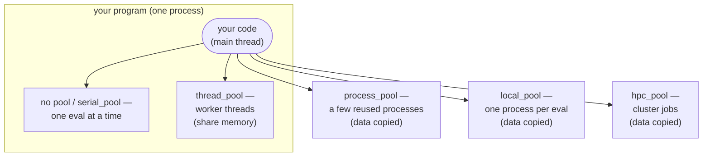

# Running in Parallel

An optimization calls your evaluation function many times. By default these calls
happen one after another, on the same thread that called
[`optimize`][ropt.simple.optimize]. If each call is slow, you can run several at
the same time by evaluating on a **worker pool**.

Pools come from a [`session`][ropt.simple.session]. Open one using a `with`
statement, ask it for the kind of pool you want, and pass that pool to the run:

```python
from ropt.simple import optimize, session

with session() as s:
    result = optimize(config, x0, objective, pool=s.thread_pool(workers=4))
```

That is the whole pattern. A session can hand out as many pools as you like, of
any kind, and each run uses the one you give it — and only that one. Closing the
session releases them all. The runnable script is
[examples/simple/parallel.py](https://github.com/TNO-ropt/ropt/blob/main/examples/simple/parallel.py),
which evaluates one optimization on a thread pool, or on a process pool when it
is passed `--multiprocessing`.

Where your objective runs depends on which pool you pass (or none):



Threads stay **inside** your program and share its memory, so any Python
function works and nothing is copied. The other three run the work **outside**
it, so the objective and its data are copied there.

Only the evaluations ever leave. The optimizer itself, the session, the pool
object and your handlers all stay put, whichever pool you choose. Below, **your
program** always means that one process — the one that opened the session and
called `optimize`.

??? info "New to threads and processes?"
    A **process** is a running program with its own private memory. A **thread**
    is a worker inside a process, and all threads in a process share that memory.
    Threads are cheap and share data for free, but Python runs only one thread's
    *Python* code at a time. Work that **waits** — for a file, a network reply,
    an external tool — overlaps freely, because a waiting thread is not running
    Python code; and so does work a library performs outside Python, as `numpy`
    does while it crunches an array. What is stuck one-at-a-time is arithmetic
    written in Python itself. Separate **processes** each have their own
    interpreter and always run truly in parallel, but they do not share memory,
    so data has to be copied between them, and starting one takes noticeably
    longer than starting a thread. A process also need not be on this machine:
    an `hpc_pool` runs each evaluation as a job on a cluster, which is the same
    arrangement spread over more machines.

## The five choices

Evaluating in place — with no pool, or with an explicit
[`serial_pool`][ropt.simple.serial_pool] — is a choice rather than the absence
of one, so there are five:

| Pool | Evaluations run | Data | Reach for it when |
| --- | --- | --- | --- |
| none, or `serial_pool` | on the calling thread, one at a time | shared | evaluations are fast — this is the default |
| `thread_pool` | on background threads in your program | shared | each evaluation mostly **waits**: an external tool, a file, a network call |
| `process_pool` | in a few reused processes | copied | each evaluation is heavy **Python computation** |
| `local_pool` | in one fresh process per evaluation | copied | each evaluation is a self-contained **job** on this machine |
| `hpc_pool` | as jobs on a cluster queue | copied | each evaluation is a large **cluster job** |

A pool costs something to set up and to hand work to, so the default is often
the right answer: below a certain evaluation cost, that setup is all a pool
adds.

[Parallel Execution and Many Runs](../running/parallel.md) covers each of these
in full — how many workers to ask for, which functions can be sent where, what
stopping does, and how to choose when the answer is not obvious.

## The rule to settle first

One question rules choices *out*, and it is the only one you can answer by
reading your own code rather than by measuring:

!!! question "Does your objective read or write anything outside its arguments and its return value?"

    Global variables, a cache, a logger, an open file or database handle, an
    event handler, a counter it increments — anything at all that outlives one
    call.

    - **No.** Every pool works. Choose on speed alone, and you can swap between
      them freely later.
    - **Yes.** Stay with threads, or with no pool at all: either way the
      objective runs in your program, where it sees the same memory.
      `process_pool`, `local_pool` and `hpc_pool` run the
      objective somewhere else, on a *copy* of everything it touched — so the
      writes land in that copy and vanish, and the reads see whatever the copy
      was made from. Nothing raises; the numbers just come out wrong.

## Running several optimizations at once

[`optimize_many`][ropt.simple.optimize_many] runs a batch of optimizations
together rather than one after another:

```python
from ropt.simple import optimize_many

results = optimize_many(config, start_points, objective)   # one run per start point
```

The runs are concurrent, and there is more to it than this call shows: how many
run at a time, which pool their evaluations share, and how to collect results
from runs that overlap are all covered in
[Parallel Execution and Many Runs](../running/parallel.md#many-optimizations-at-once).

!!! warning "Your objective is now called from several threads at once"

    The call above passes no pool, so each run evaluates on its own thread. The
    question above applies here too, and nothing warns you: if your objective
    reads or writes anything outside its arguments and its return value, the
    runs will corrupt each other. Give the batch a pool, or keep the objective
    self-contained.

## See also

- Collecting results from runs that overlap in time:
  [Result Handlers](../running/handlers.md#sharing-a-handler-across-concurrent-runs).
- When more workers made it slower, or Ctrl-C seemed to do nothing:
  [Common Pitfalls](../troubleshooting/index.md).
