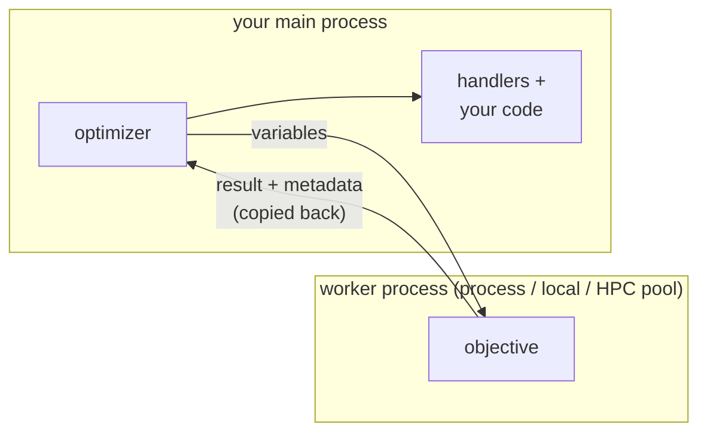

# Result Handlers

An [`optimize`][ropt.optimize] call returns only the best result. A
**handler** lets you collect or react to *every* result instead: it is an object
that observes an optimization and processes its results as they arrive — keeping
them, tabulating them, or invoking a callback.

A handler is given [`Results`][ropt.results.Results] objects —
[`FunctionResults`][ropt.results.FunctionResults] and
[`GradientResults`][ropt.results.GradientResults] — which is what every other part of
`ropt` provides too: a `report` callback receives one per evaluation, and
`optimize` puts the best one on the `results` field of what it returns.
Everything a run produces is in them, at the field paths described in
[Working with Results](results.md), which is the vocabulary the handlers below
are configured in.

The [`report`](../running/running.md#reporting-progress) callback you may already be using
is only shorthand for this: `report=` builds a handler for you behind the
scenes, added to the run it is given to. One is built per run, each with a lock
of its own, so the same callback given to runs that execute concurrently can be
entered from several threads at once. A handler object given to those runs is
entered by one at a time, because the lock belongs to the handler. A callback
that accumulates across concurrent runs needs synchronization of its own.

Attach handlers to a run with the `handlers` argument. The same handler can be
passed to several `optimize` calls, accumulating the results of each in turn:

```python
from ropt import HistoryHandler, optimize

history = HistoryHandler()

optimize(config, x0, objective, handlers=[history])       # a single run
for x0 in start_points:                                   # ...or reused to
    optimize(config, x0, objective, handlers=[history])   # accumulate in turn

print(history.results)   # every result collected, across all the runs above
```

Handlers that store results expose them through `handler["results"]` (and, for
`HistoryHandler`, the `history.results` shortcut).

## Sharing a handler across concurrent runs

The same handler may also be given to runs that execute **concurrently** — the
runs of an [`optimize_many`](../running/many_runs.md), or runs
you start on threads of your own. A handler's
[`handle_event`][ropt.EventHandler.handle_event]
takes a lock around each call, so a second run waits for the first to finish
rather than interleaving with it:

```python
from ropt import HistoryHandler, session

history = HistoryHandler()
with session() as s:
    s.thread_pool(workers=4).optimize_many(
        config,
        start_points,
        objective,
        handlers=[history],
    )

print(history.results)
```

The results of the concurrent runs arrive interleaved, in an order that depends
on which run reaches the handler first. Take the order from the results
themselves — `batch_id`, or a `metadata` field you set per run — rather than
from the order they arrive in.

[examples/handlers.py](https://github.com/TNO-ropt/ropt/blob/main/examples/handlers.py)
feeds two handlers from the same set of concurrent runs:

```python
--8<-- "examples/handlers.py:shared"
```

!!! warning "Do not start a run from inside a handler that the run can reach"
    A handler is free to start a run of its own, but its own lock is held while
    it does. If that run lists the same handler, the handler is entered a
    second time. The outcome depends on the run the handler starts, not on the
    call that is feeding the handler. A nested
    [`optimize`][ropt.optimize] emits on the thread that called it — the
    one already inside the handler — so this raises a
    [`WorkflowError`][ropt.exceptions.WorkflowError]. A nested
    [`optimize_many`][ropt.optimize_many] emits on driver threads of its
    own, which wait for a lock the first thread will not release until the run
    ends, and both stop. The same holds for two handlers that each start a run
    reaching the other. Give the inner run handlers of its own.

Two handlers that write to the same external state are each serialized on their
own, but not as a pair: a run can be inside one while another run is inside the
other. Take a [`threading.Lock`][threading.Lock] of your own inside both
`_handle_event` implementations if they must not overlap.

## Built-in handlers

The handlers below are exported from `ropt`, ready to use as they are.

### `ResultsHandler`

[`ResultsHandler`][ropt.ResultsHandler] keeps a single result, read via
`handler["results"]`:

- `what="best"` (default) keeps the result with the lowest weighted objective
  seen so far; `what="last"` keeps the most recent valid result.
- `constraint_tolerance` (optional) discards results that violate a constraint
  by more than the given tolerance.
- `filter` (optional) is a callable that receives each
  [`Results`][ropt.results.Results] and returns `True` to keep it or `False` to
  drop it.

The gradient computed at the result it keeps, if there is one, is read via
`handler["gradient"]`. A gradient usually reaches the handler in a later
evaluation than that result, and is attached to it only if both of these hold:

- [`GradientResults.uses`][ropt.results.GradientResults.uses] returns `True`
  for the result, meaning the gradient was constructed from its values;
- the gradient is at the same point as the result.

In general the first does not imply the second. The
[stochastic gradient](../optimizer_setup/gradients.md) that `ropt` currently
estimates is always at the point of the function evaluation it was constructed
from, so for this gradient the second test always passes. `handler["gradient"]`
is `None` while that gradient has not arrived, and stays `None` for a point
where no gradient was computed — the best point of a run often is one.


### `HistoryHandler`

[`HistoryHandler`][ropt.HistoryHandler] keeps *every* result it receives,
in order, as a tuple. Read it with `handler.results`, which is an empty tuple
until the first result arrives, or with `handler["results"]`, the raw stored
value, which is `None` until then.

### `DataFrameHandler`

[`DataFrameHandler`][ropt.DataFrameHandler] collects results into named
DataFrames, using either `polars` (the default) or `pandas` as its engine; the
corresponding package must be installed. Define a table with
`add_table(name, table_type, columns)`, where `table_type` is
`"functions"` or `"gradients"` and `columns` maps result-field names (dotted
attribute syntax) to column titles. The field names are those of the result
objects, so `variables` and `scaled.variables` select different columns; see
[Working with Results](results.md).

```python
from ropt import DataFrameHandler

tables = DataFrameHandler()
tables.add_table(
    "summary",
    "functions",
    {
        "batch_id": "Batch",
        "functions.objectives": "Objective",
        "variables": "Variable",
    },
)
optimize(config, x0, objective, handlers=[tables])
df = tables["summary"]
```

Read one table with `tables["summary"]`, or all of them with `get_tables()`.
Columns appear in the order the specification lists them. A
field whose value is a vector or matrix expands to several columns; the extra
column levels come from the field's axis labels (or indices), joined to the
title with a separator (`,` by default, set with `sep=`). The labels come from
the [`names`](../optimizer_setup/configuration_sections.md#names) mapping: a length-2
`variables` gives `Variable,v0` and `Variable,v1` when the variables are named
`v0` and `v1`, and `Variable,0` and `Variable,1` when they are not. Because the
column names follow
[`results_to_pandas`](results.md#metadata-columns), both
result-level and per-realization metadata can be included and renamed.

Tables are built with polars by default. Pass `engine="pandas"` to get pandas
DataFrames instead:

```python
tables = DataFrameHandler(engine="pandas")
```

The tables carry the same columns under the same titles. As explained in
[Exporting to polars](results.md#exporting-to-polars), polars
has no index, so the key columns (`batch_id`, `realization`, and the other axis
names) appear as ordinary leading columns rather than in the index; with pandas
they form the index instead. Both engines align fields of differing
granularity, broadcasting a per-batch field across the per-realization rows.

Convenience methods:

- `set_default_tables()` registers a standard set of tables
  (`functions`, `evaluations`, `constraints` for function results; `gradients`,
  `perturbations` for gradient results). Its `constraints` table requires a
  problem that defines bounds or constraints.
- `add_column(table, name, title)` adds one column to an existing table.
- `set_callback(fn)` calls `fn(output_dir)` whenever the tables are updated,
  where `output_dir` is the run's configured
  [`output_dir`](../optimizer_setup/configuration_sections.md#optimizer) (`None` if it is
  not set).

!!! tip "Write the tables to a file as they update"
    `set_callback` fires on every update, so it is a convenient hook for saving
    the tables — to watch progress live or to write a final report. Pandas'
    `to_string()` gives aligned, human-readable columns with no extra
    dependencies; use `to_csv()` for machine-readable data, or `to_markdown()`
    if you have `tabulate` installed:

    ```python
    def dump(output_dir):
        path = Path("progress.txt") if output_dir is None else output_dir / "progress.txt"
        with path.open("w") as fh:
            for name, df in tables.get_tables().items():
                fh.write(f"# {name}\n{df.to_string()}\n\n")

    tables.set_callback(dump)
    optimize(config, x0, objective, handlers=[tables])
    ```

    Because this writes to disk on every update, the run that emitted the
    result waits for the write to finish.

## Writing your own handler

The built-in handlers above, and the `report` callback, cover the results a run
produces. A handler of your own is for everything else: reacting to the start or
the end of a run, writing results out in a format of your own, or keeping a
summary that none of the built-ins keeps.

Subclass [`EventHandler`][ropt.EventHandler] and implement two members:

- `event_types` — the [`EnOptEventType`][ropt.enums.EnOptEventType] values this
  handler wants to receive. An event of any other type never reaches it.
- `_handle_event(event)` — called with each
  [`EnOptEvent`][ropt.events.EnOptEvent] of those types.

```python
from ropt.enums import EnOptEventType
from ropt.events import EnOptEvent
from ropt import EventHandler, optimize


class CountEvaluations(EventHandler):
    def __init__(self):
        super().__init__()
        self.count = 0

    @property
    def event_types(self):
        return {EnOptEventType.FINISHED_EVALUATION}

    def _handle_event(self, event: EnOptEvent) -> None:
        self.count += len(event.results)


counter = CountEvaluations()
optimize(config, x0, objective, handlers=[counter])
print(counter.count)
```

An [`EnOptEvent`][ropt.events.EnOptEvent] carries the `event_type` that
triggered it and a `results` tuple, which holds the
[`Results`][ropt.results.Results] objects of a `FINISHED_EVALUATION` and is
empty for the other types. Its `source` is the run that emitted the event, and
calling `event.source.stop()` ends that run at the next evaluation boundary,
with exit code `STOPPED`. The types a run emits are:

| Event type            | When it is emitted                                          |
| --------------------- | ----------------------------------------------------------- |
| `START_OPTIMIZER`     | Just before the optimization algorithm begins iterating.    |
| `FINISHED_OPTIMIZER`  | After it finishes, whether it converged, stopped or failed. |
| `START_EVALUATION`    | Before a batch of function or gradient evaluations.         |
| `FINISHED_EVALUATION` | After that batch completes; carries its results.            |

An [`evaluate`][ropt.evaluate] or
[`evaluate_batch`][ropt.evaluate_batch] run has no optimizer, and emits
`START_ENSEMBLE_EVALUATOR` and `FINISHED_ENSEMBLE_EVALUATOR` around its single
batch instead of the optimizer pair.

Handlers are called on the thread that emits the event, in the order the
`handlers` argument lists them, and the run waits until every handler for that
event has returned. A handler that blocks therefore holds up the run that fed
it, and any run waiting on the same handler's lock. Keep a handler shared by
concurrent runs cheap; if one must do heavy I/O, buffer in memory and write once
the runs have finished.

!!! note "A handler failure ends the run"
    An exception raised by a handler is fatal. It is raised on the run's own
    stack, so it propagates as a single exception, and the handlers listed after
    it do not see that event.

!!! note "Read a handler's state after its runs have finished"
    State kept on a handler, or stored with `handler[key]`, is deliberately not
    bound to a thread, so it can be read from anywhere once the runs feeding it
    have returned. That return is what makes the latest values visible. Reading
    it while a run is still feeding the handler on another thread gives a valid
    but possibly stale value. To follow a run as it goes, use the handler's own
    `_handle_event`, or a `report` callback, rather than polling another
    handler's state.

## Handlers and separate processes

On a thread pool (or with no pool) your objective and your handlers run
in the **same process** and share memory: a handler can see anything the
objective left behind — a global it set, a list it appended to, an object it
mutated.

A process, local, or HPC pool breaks that. The objective runs in a **separate
worker process**, while the optimizer, your handlers, and the rest of your
program stay
in the **main process**. They cannot share memory. The objective's *only* way to
send information back is through what it **returns** — the objective and
constraint values, and the result's `metadata` — all copied back to the main
process:



??? info "How data is copied between processes"
    To move work and results between processes, `ropt` **serializes** them —
    turns the objects into bytes and rebuilds them on the other side. Both a
    process pool and an HPC pool use Python's standard `pickle` by default, so
    an objective defined at module level works as is; a lambda, a closure, or a
    notebook-defined objective needs the optional `cloudpickle` extra. Most
    functions and data serialize fine, but things like open files, locks, or
    database connections may not.

    On a process pool the bytes travel over an in-machine channel. On an
    HPC pool they are written as **files on a shared filesystem** that the
    cluster nodes read, so it needs such a filesystem (its `workdir`).

    Serialization is only the mechanism `ropt` uses today; the essential
    requirement is that the data can be *moved from one process to the other*,
    so a future version could use a different transport — for example one that
    works over a network.

Handlers see those returned results and nothing else. Anything the objective did
only in memory — setting a module global, appending to a shared list, updating an
object — happened **inside the worker** and is discarded when it finishes; your
handlers and your main program never see it.

!!! note "Pools stay in the main process"
    A pool is tied to the process that opened its session, so it is not usable
    in a worker. An objective that closes over one — to offload work, or to
    start an inner run on it — is stopped in the worker, which reports the
    object by name. Do that work in the objective itself, or return what you
    need and act on it in the main process.

So to get extra information from an evaluation to a handler (or to a later part
of your program), **return it** instead of stashing it in shared state: attach it
to the result's `metadata` (see [Attaching metadata](../running/running.md#attaching-metadata)), which
is returned with the result. Relying on shared state happens to work on a
thread pool, but breaks the moment you switch to a process pool;
returning the data works everywhere.
