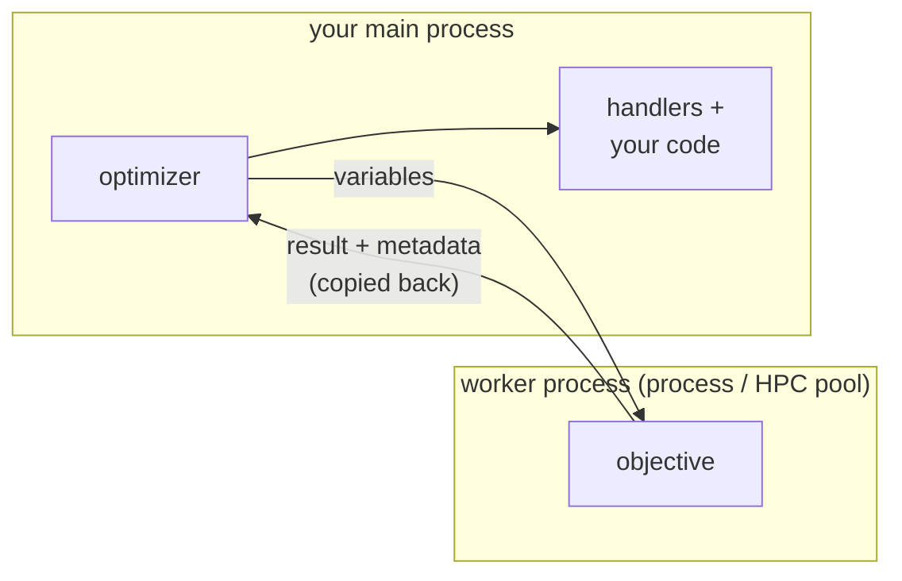

# Result Handlers

An [`optimize`][ropt.simple.optimize] call returns only the best result. A
**handler** lets you collect or react to *every* result instead: it is an object
that observes an optimization and processes its results as they arrive — keeping
them, tabulating them, or invoking a callback.

A handler is given [`Results`][ropt.results.Results] objects —
`FunctionResults` and `GradientResults` — which is what every other part of the
simple API hands out too: a `report` callback receives one per evaluation, and
`optimize` puts the best one on the `results` field of what it returns.
Everything a run produces is in them, at the field paths described in
[Working with Results](results.md), which is the vocabulary the handlers below
are configured in.

The [`report`](running.md#reporting-progress) callback you may already be using
is only shorthand for this: `report=` builds a handler for you behind the
scenes. Where you pass it decides which kind. Given to a run, as
`optimize(..., report=...)`, it becomes a **local** handler of that run. Given
to [`shared_handlers`][ropt.simple.Session.shared_handlers], as
`shared_handlers(..., report=...)`, it joins that
[group](#sharing-a-handler-across-concurrent-runs) instead, and sees the results
of every run feeding it.

Attach handlers to a run with the `handlers` argument. The same handler can be
passed to several **sequential** `optimize` calls, accumulating the results of
each in turn:

```python
from ropt.simple import HistoryHandler, optimize

history = HistoryHandler()

optimize(config, x0, objective, handlers=[history])       # a single run
for x0 in start_points:                                   # ...or reused to
    optimize(config, x0, objective, handlers=[history])   # accumulate in turn

print(history.results)   # every result collected, across all the runs above
```

Handlers that store results expose them through `handler["results"]` (and, for
`HistoryHandler`, the `history.results` shortcut).

## Sharing a handler across concurrent runs

A local handler belongs to one run at a time, so it cannot collect from
optimizations that run **concurrently** — the runs of an
[`optimize_many`](parallel.md#many-optimizations-at-once). Put it
in a **shared group** instead, built on the session with
[`shared_handlers`][ropt.simple.Session.shared_handlers], and pass the group
where you would pass the handler:

```python
from ropt.simple import HistoryHandler, optimize_many, session

history = HistoryHandler()
with session() as s:
    pool = s.thread_pool(workers=4)
    collected = s.shared_handlers(history)
    optimize_many(config, start_points, objective, pool=pool, handlers=[collected])

print(history.results)
```

A group takes as many handlers as you like — `shared_handlers(history, tables)` —
and every one of them sees the results of every run feeding the group. A group
is passed around exactly like a pool: it is an object, so a run can feed
several groups at once, mix them with local handlers of its own, and nothing is
picked up from the surrounding code. `optimize_many` accepts *only* groups in
`handlers=` — a bare handler there is rejected, because its runs overlap.

[examples/simple/handlers.py](https://github.com/TNO-ropt/ropt/blob/main/examples/simple/handlers.py)
feeds two groups from the same set of concurrent runs:

```python
--8<-- "examples/simple/handlers.py:groups"
```

Like a pool, a group lives until its session closes, which releases it and hands
its handlers back; the same handler objects can then join a group on a later
session.

Closing a group earlier **releases its handlers**. A handler belongs to one
group at a time, so this is what lets you put one into another group; otherwise
only the session ending frees it. The group also hands back the dispatcher it
runs on, together with any worker threads a `threaded` handler needed — which is
why groups built in a loop are worth closing as you go rather than all at the
end. Use [`close`][ropt.simple.SharedHandlers.close], or the group as a context
manager, which closes it on exit:

```python
with session() as s:
    for start_points in cases:
        with s.shared_handlers(history) as collected:
            optimize_many(config, start_points, objective, handlers=[collected])
```

Closing discards nothing: the handlers are your own objects, and a released
`HistoryHandler` still holds everything it collected. Nor can it lose a result,
since a run waits for its events to be handled before it goes on. What ends is
the group's use as a destination — a closed group is refused like a closed pool,
so a run given one stops immediately with a
[`WorkflowError`][ropt.exceptions.WorkflowError] rather than running to
completion while its results go nowhere.

!!! warning "Reach for a shared group only for real concurrency"
    A group routes every run's events through a single, serialized
    `EventDispatcher` on a background loop. That serialization is what makes a
    handler safe to share across *concurrent* runs — but around a plain
    **sequential** loop it adds cost without benefit: a background loop plus a
    cross-thread hand-off per result. Prefer a reused local handler for
    sequential accumulation, and keep groups for genuinely concurrent runs. When
    you do share a group, move any slow, GIL-releasing (I/O) handler onto a
    worker thread with [`threaded`](#running-a-handler-in-a-thread) so it does
    not stall the shared loop for every run.

!!! warning "Local first, shared never after"
    The two roles are not interchangeable, and a handler can move from one to
    the other in only one direction. A group releases its handlers when it
    closes, so a handler that has only ever been shared can afterwards be used
    either way. But passing a handler to a run as a local handler binds it to
    that run's compute step permanently, and `shared_handlers` will refuse it
    from then on. Decide per handler which of the two roles it plays; if you
    need both, use two handlers.

## Built-in handlers

The handlers below are re-exported from `ropt.simple`, ready to use as they
are.

### `ResultsHandler`

[`ResultsHandler`][ropt.simple.ResultsHandler] keeps a single result, read via
`handler["results"]`:

- `what="best"` (default) keeps the result with the lowest weighted objective
  seen so far; `what="last"` keeps the most recent valid result.
- `constraint_tolerance` (optional) discards results that violate a constraint
  by more than the given tolerance.
- `filter` (optional) is a callable that receives each
  [`Results`][ropt.results.Results] and returns `True` to keep it or `False` to
  drop it.


### `HistoryHandler`

[`HistoryHandler`][ropt.simple.HistoryHandler] keeps *every* result it receives,
in order, as a tuple. Read it with `handler.results`, which is an empty tuple
until the first result arrives, or with `handler["results"]`, the raw stored
value, which is `None` until then.

### `DataFrameHandler`

[`DataFrameHandler`][ropt.simple.DataFrameHandler] collects results into named
DataFrames, using either `polars` (the default) or `pandas` as its backend; the
corresponding package must be installed. Define a table with
`add_table(name, table_type, columns)`, where `table_type` is
`"functions"` or `"gradients"` and `columns` maps result-field names (dotted
attribute syntax) to column titles. The field names are those of the result
objects, so `variables` and `scaled.variables` select different columns; see
[Working with Results](results.md).

```python
from ropt.simple import DataFrameHandler

tables = DataFrameHandler()
tables.add_table(
    "summary",
    "functions",
    {
        "batch_id": "Batch",
        "functions.objectives": "Objective",
        "variables": "Variable",
    },
)
optimize(config, x0, objective, handlers=[tables])
df = tables["summary"]
```

Read one table with `tables["summary"]`, or all of them with `get_tables()`.
Columns appear in the order the specification lists them. A
field whose value is a vector or matrix expands to several columns; the extra
column levels come from the field's axis labels (or indices), joined to the
title with a separator (`,` by default, set with `sep=`). The labels come from
the [`names`](../optimizer_setup/configuration_sections.md#names) mapping: a length-2
`variables` gives `Variable,v0` and `Variable,v1` when the variables are named
`v0` and `v1`, and `Variable,0` and `Variable,1` when they are not. Because the
column names follow
[`results_to_pandas`](results.md#metadata-columns), both
result-level and per-realization metadata can be included and renamed.

Tables are built with polars by default. Pass `engine="pandas"` to get pandas
DataFrames instead:

```python
tables = DataFrameHandler(engine="pandas")
```

The tables carry the same columns under the same titles. As explained in
[Exporting to polars](results.md#exporting-to-polars), polars
has no index, so the key columns (`batch_id`, `realization`, and the other axis
names) appear as ordinary leading columns rather than in the index; with pandas
they form the index instead. Both backends align fields of differing
granularity, broadcasting a per-batch field across the per-realization rows.

Convenience methods:

- `set_default_tables()` registers a standard set of tables
  (`functions`, `evaluations`, `constraints` for function results; `gradients`,
  `perturbations` for gradient results). Its `constraints` table requires a
  problem that defines bounds or constraints.
- `add_column(table, name, title)` adds one column to an existing table.
- `set_callback(fn)` calls `fn(output_dir)` whenever the tables are updated,
  where `output_dir` is the run's configured
  [`output_dir`](../optimizer_setup/configuration_sections.md#optimizer) (`None` if it is
  not set).

!!! tip "Write the tables to a file as they update"
    `set_callback` fires on every update, so it is a convenient hook for saving
    the tables — to watch progress live or to write a final report. Pandas'
    `to_string()` gives aligned, human-readable columns with no extra
    dependencies; use `to_csv()` for machine-readable data, or `to_markdown()`
    if you have `tabulate` installed:

    ```python
    def dump(output_dir):
        path = Path("progress.txt") if output_dir is None else output_dir / "progress.txt"
        with path.open("w") as fh:
            for name, df in tables.get_tables().items():
                fh.write(f"# {name}\n{df.to_string()}\n\n")

    tables.set_callback(dump)
    optimize(config, x0, objective, handlers=[tables])
    ```

    Because this writes to disk on every update, it is a good candidate for
    [running on a worker thread](#running-a-handler-in-a-thread).

### Other handlers

`ropt.components.event_handlers` holds a few more handlers that `ropt.simple`
does not re-export, because a run driven by `optimize` does not need them.

The one you may still reach for is
[`CallbackHandler`][ropt.components.event_handlers.CallbackHandler], which
calls a function for the event types you name. That is how you observe events
other than results — the start or end of a run, for example; for results alone,
`report=` already does it. The rest belong to the component API, described in
[Optimization Workflows](../advanced/workflows.md#event-handlers).

## Custom handlers

Handlers are not limited to the built-ins: you — or another package — can
provide your own by implementing `ropt`'s event-handler interface. The
[Optimization Workflows](../advanced/workflows.md#event-handlers) describes the event
model, the handler protocol, and how to write one.

A custom handler can also **stop its own optimization**: every event carries the
compute step that emitted it, so calling `event.source.stop()` from `handle_event`
ends that run gracefully with `USER_ABORT` (the [`report`](running.md#stopping-early-from-the-callback)
callback above is just a convenience wrapper around this). Only the run that owns
the emitting step is affected, so concurrent runs continue. See
[Optimization Workflows](../advanced/workflows.md#exit-codes).

## Running a handler in a thread

By default every handler runs **inline**, on the thread that drives the
optimization: each result is delivered to the handlers one after another, and the
run waits for `handle_event` to return before it continues. That is exactly what
you want for handlers that only touch memory — storing results, updating a
DataFrame, keeping a running statistic — because the work is fast and there is no
reason to hand it off.

A [shared group](#sharing-a-handler-across-concurrent-runs) can instead run one
or more handlers on a **worker thread** with the `threaded` keyword. Pass it a
single handler or a sequence of handlers; those handlers run off the driving
thread, while positional handlers stay inline:

```python
from ropt.simple import DataFrameHandler, HistoryHandler, optimize, session

history = HistoryHandler()          # cheap, in-memory  -> inline
tables = DataFrameHandler()         # writes a report to disk -> worker thread
tables.set_default_tables()
tables.set_callback(dump_to_disk)   # some function that writes a file

with session() as s:
    collected = s.shared_handlers(history, threaded=tables)
    for x0 in start_points:
        optimize(config, x0, objective, handlers=[collected])
```

Moving a handler to a thread changes **where** its code runs, nothing else: the
run still waits for every handler to finish before delivering the next result,
results still arrive in order, and an exception raised by a threaded handler is
re-raised on the run's own stack, so early stops and fatal errors propagate
exactly as they do for an inline handler.

!!! warning "Only I/O-bound handlers benefit"
    `threaded` helps in **one** situation: a handler that spends most of its time
    waiting on an operation that *releases* CPython's global interpreter lock
    (GIL) — writing to a file, a socket or a database, or a NumPy/C routine that
    drops the lock. Only then can the optimization make progress while that work
    is in flight.

    Under the GIL only one thread runs Python bytecode at a time. A handler that
    stays in Python — building DataFrames, accumulating results, doing numerical
    work in pure Python — therefore gets **no** speed-up from `threaded`. It
    merely pays the small cost of handing work to another thread, which makes it
    marginally *slower*, never faster. When in doubt, leave a handler inline; only
    reach for `threaded` when you know it is busy with interruptible I/O.

`threaded` is only available on a shared group; a local handler always runs
inline. To run a blocking handler on a thread for just one optimization, give it
a group of its own:

```python
with session() as s:
    optimize(config, x0, objective, handlers=[s.shared_handlers(threaded=slow_writer)])
```

## Handlers and the process boundary

On a thread pool (or with no pool) your objective and your handlers run in the
**same process** and share memory: a handler can see anything the objective left
behind — a global it set, a list it appended to, an object it mutated.

A process, local, or HPC pool breaks that. The objective runs in a **separate
worker process**, while the optimizer, your handlers, and the rest of your
program stay
in the **main process**. They cannot share memory. The objective's *only* way to
send information back is through what it **returns** — the objective and
constraint values, and the result's `metadata` — all copied back to the main
process:



??? info "How data crosses the boundary"
    To move work and results between processes, `ropt` **serializes** them —
    turns the objects into bytes and rebuilds them on the other side. Both a
    process pool and an HPC pool use Python's standard `pickle` by default, so
    an objective defined at module level works as is; a lambda, a closure, or a
    notebook-defined objective needs the optional `cloudpickle` extra. Most
    functions and data serialize fine, but things like open files, locks, or
    database connections may not.

    On a process pool the bytes travel over an in-machine channel. On an HPC pool
    they are written as **files on a shared filesystem** that the cluster nodes
    read, so an HPC pool needs such a shared filesystem (its `workdir`).

    Serialization is only the mechanism `ropt` uses today; the essential
    requirement is that the data can be *carried across the boundary*, so a
    future version could use a different transport — for example one that works
    over a network.

Handlers see those returned results and nothing else. Anything the objective did
only in memory — setting a module global, appending to a shared list, updating an
object — happened **inside the worker** and is discarded when it finishes; your
handlers and your main program never see it.

!!! note "Sessions stay in the main process"
    A pool, a shared group, and the session behind them are tied to the main
    process, so they are not usable in a worker. An objective that closes over
    one — to offload work, or to start an inner run on it — is stopped in the
    worker, which reports the object by name. Do that work in the objective
    itself, or return what you need and act on it in the main process.

So to get extra information from an evaluation to a handler (or to a later part
of your program), **return it** instead of stashing it in shared state: attach it
to the result's `metadata` (see [Attaching metadata](running.md#attaching-metadata)), which
is returned with the result. Relying on shared state happens to work on a
thread pool, but breaks the moment you switch to a process pool; returning the
data works everywhere.
