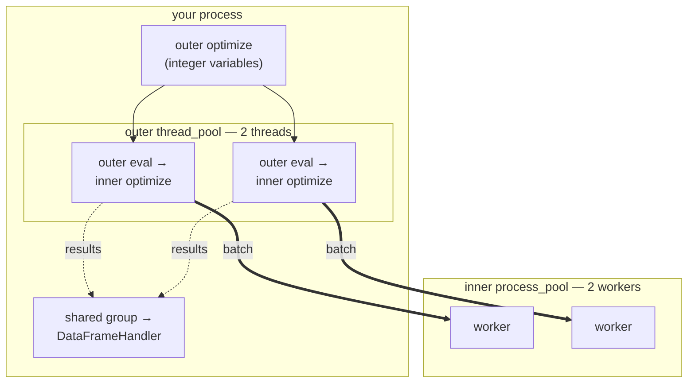

# Nested Optimization

Some problems split naturally into two layers: a few variables that are awkward
for one method — integers, say, or switches — and the rest, which a gradient
method handles well. **Nested optimization** solves them in two loops. An outer
run varies the awkward variables, and every outer evaluation runs a complete
inner optimization over the remaining ones, returning the best value it reached.

!!! tip "This page also covers three things that are not nesting"
    Nesting itself is a niche, but this page puts three things that are not
    into one program small enough to read end to end: choosing a pool per
    layer, and why one of them has to stay on threads; collecting results from
    runs that overlap in time, through a shared group; and moving the expensive
    layer to a cluster by changing a single line.

Nothing in `ropt` is dedicated to this: the outer evaluation function simply
calls [`optimize`][ropt.simple.optimize] itself. What needs care is the plumbing
around it — which
variables each layer owns, which pool each layer evaluates on, and how to get
the results out.



Solid arrows start a run, thick arrows carry evaluations out to a worker
process, and dotted arrows carry results back to the handler. Both pools are
drawn: the outer one is inside your process, the inner one is not. The sections
below work through each part.

The runnable script for this page is
[examples/simple/nested_optimization.py](https://github.com/TNO-ropt/ropt/blob/main/examples/simple/nested_optimization.py).
It needs the `polars` extra.

## Splitting the variables

Both layers describe the *same* variable vector; each is handed the half it may
change. The `mask` field does this, and the two masks are complements:

```python
--8<-- "examples/simple/nested_optimization.py:configs"
```

A masked-out variable keeps the value it was given and is not passed to the
optimizer, so the inner run treats the outer variables as constants and the
outer run never touches the inner ones. The two layers can otherwise be
configured completely differently — here the outer is integer-valued and
gradient-free, while the inner is continuous and uses an ensemble of five
realizations. See [`variables`](../optimizer_setup/configuration_sections.md#variables)
for the field, and
[Discrete and Mixed-Integer Variables](../optimizer_setup/discrete.md) for the
outer method.

## The outer evaluation function

An outer evaluation *is* an inner optimization. The function receives the outer
variables, merges them into a full vector, runs `optimize`, and returns the best
objective it found:

```python
--8<-- "examples/simple/nested_optimization.py:inner"
```

`np.where(MASK, INITIAL_VALUES, variables)` builds the inner start point: the
inner variables begin where they always do, and the outer ones carry the values
being tried. The `metadata` tags every inner result with the outer evaluation
that caused it, which is what makes the collected results traceable.

## Two pools, not one

Each layer evaluates on its own pool, and that is a requirement rather than a
preference:

```python
--8<-- "examples/simple/nested_optimization.py:run"
```

The outer pool is a **thread** pool. Outer evaluations therefore stay inside
this process, where the inner pool and the shared handler group are live
objects; on a process pool they would arrive as copies and be useless. The inner
pool is a **process** pool, which is where the real work goes.

That is also where a cluster belongs. Swapping the inner pool for an
[`hpc_pool`][ropt.simple.Session.hpc_pool] is the whole change — the inner
evaluations become cluster jobs, and the layer above is untouched:

```python
inner_pool = active.hpc_pool(workers=50)
```

Sending whole *optimizations* to the cluster, by putting the **outer** pool on
processes or HPC, is possible but buys something different. Each outer
evaluation is then copied into a job, and neither the inner pool nor the shared
group can travel with it: the job has to open its own session and collect its
own results, and return them as data for you to combine. Use that when the
outer evaluations are genuinely independent; use the shape above when you want
one pool and one table across all of them.

The inner pool takes `bundle_size=0`, which sends a whole inner batch to one
worker as a single task. Within one inner run that gives up parallelism
completely — its five realizations are evaluated one after another — but the
parallelism here comes from the layer above: two outer evaluations run at once,
each feeding the inner pool one task, so both workers are busy and each batch
costs one transfer instead of five. See
[How a batch is split across workers](parallel.md#how-many-workers).

Handing the inner run the pool it is already running on would deadlock, and
`ropt` refuses it rather than hanging — see
[Pools inside an evaluation](parallel.md#pools-inside-an-evaluation) for why.

## Collecting results from runs that overlap

The inner runs are concurrent, so a plain handler cannot collect them: a handler
is claimed by one run at a time, and the second run to ask for it is refused. A
[**shared group**](handlers.md#sharing-a-handler-across-concurrent-runs) can,
because it routes every run's results through one dispatcher. Feed it a
[`DataFrameHandler`](handlers.md#dataframehandler) and every inner evaluation
from every inner run lands in one table, keyed by the outer evaluation it
belongs to.

Reading the answer takes one more step than usual:

```python
--8<-- "examples/simple/nested_optimization.py:best"
```

The outer result is not the place to look. The outer layer only ever sees its
own variables and holds the inner ones at their initial values, so the optimum
over *all* variables exists only in the collected inner results.

## See also

- The same flow built from workflow components:
  [Parallel Evaluation](../advanced/parallel.md).
