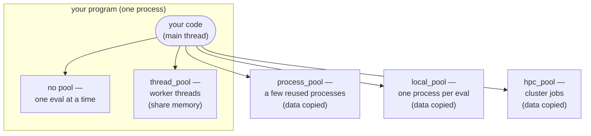

# Evaluating in Parallel

Evaluations within one optimization can run in parallel, and work of your own
can be offloaded the same way. Both go through a **pool**.

## Running in parallel

By default [`optimize`][ropt.simple.optimize] runs on the calling thread, one
evaluation at a time. To run the evaluations in parallel, open a
[`session`][ropt.simple.session], build a **pool** on it and start the run on
that pool:

```python
from ropt.simple import session

with session() as s:
    result = s.thread_pool(workers=8).optimize(config, x0, objective)
```

The runnable script for this section is
[examples/simple/parallel.py](https://github.com/TNO-ropt/ropt/blob/main/examples/simple/parallel.py),
which takes `-m` to swap its thread pool for a process pool.

The session owns the pools built on it and releases their workers when its
block ends, so most code needs no further cleanup. Nothing is implicit: a run
evaluates on the pool it was started on, and on no other. A run started with
the module-level [`optimize`][ropt.simple.optimize] evaluates inside your own
program and needs no session, wherever it is called from — including from a
thread you started yourself.

Where an evaluation runs depends on which pool it was started on:



Threads stay **inside** your program and share its memory, so any Python
function works and nothing is copied. The other three run the work **outside**
it, so the objective and its data are copied there.

Only the evaluations ever leave. The optimizer itself, the pool object and your
handlers all stay in the process that opened the session and started the run,
whichever pool you choose. Throughout this page, **your program** means that
process.

??? info "New to threads and processes?"
    A **process** is a running program with its own private memory. A **thread**
    is a worker inside a process, and all threads in a process share that memory.
    Threads are cheap and share data for free, but Python runs only one thread's
    *Python* code at a time. Work that **waits** — for a file, a network reply,
    an external tool — overlaps freely, because a waiting thread is not running
    Python code; and so does work a library performs outside Python, as `numpy`
    does while it works on an array. What is stuck one-at-a-time is arithmetic
    written in Python itself. Separate **processes** each have their own
    interpreter and always run truly in parallel, but they do not share memory,
    so data has to be copied between them, and starting one takes noticeably
    longer than starting a thread. A process also need not be on this machine:
    an HPC pool runs each evaluation as a job on a cluster, which is the
    same arrangement spread over more machines.

### How many workers?

`ropt` parallelizes two things, and only these two: the **evaluations within one
optimization batch**, and whole **optimizations against each other**. Nothing
else overlaps — a single optimization is a sequence of batches, and the next one
cannot start before the current one is complete.

So the number of workers that can be kept busy is roughly

```
batch size  ×  optimizations running at once
```

capped by what the machine or the queue will actually give you. Beyond that
figure the extra workers have nothing to do and sit idle.

Batch size follows from the problem, not from a setting: it is how many
evaluations the optimizer requests at once. For a gradient-based run over an
ensemble that is one per realization, plus their perturbations on the batches
where a gradient is estimated. The second factor is `1` unless you use
[`optimize_many`][ropt.simple.optimize_many], where it is the `limit` argument
(or the number of runs, if you set no limit).

A worker is not free, so this is an upper bound rather than a target. Ask for
what the work needs; the useful number is usually much smaller than the
machine's core count.

!!! tip "How a batch is split across workers"
    Each evaluation in a batch is transferred to a worker on its own by
    default, which spreads the batch as widely as the pool allows. Every
    transfer costs something, though, so when the evaluations are cheap the
    transfers can dominate. Pass `bundle_size=` to
    [`WorkerPool.optimize`][ropt.simple.WorkerPool.optimize],
    [`optimize_many`][ropt.simple.WorkerPool.optimize_many],
    [`evaluate`][ropt.simple.WorkerPool.evaluate] or
    [`evaluate_batch`][ropt.simple.WorkerPool.evaluate_batch] to send several
    evaluations to a worker together, or `bundle_size=0` to send a whole batch
    at once. The evaluations in one bundle run after each other, so `0` gives up
    parallelism inside the batch entirely: it is for a run whose parallelism
    comes from the layer above it, as in
    [Nested Optimization](nested.md#two-pools-not-one).

    `workers` and `bundle_size` are the two halves of matching work to capacity,
    one on the pool and one on the run. `workers` sets how many bundles may
    be in flight; `bundle_size` sets how much work one of them carries. With a
    batch of 100 cheap evaluations and 8 workers, the default sends 100 separate
    transfers to keep 8 workers busy; `bundle_size=13` sends 8. Raise it when
    the evaluations are cheap relative to a transfer, which on a process, local
    or HPC pool means copying data and starting something. Leave it at `1` when
    the evaluations are expensive, or when they vary in cost and bundling would
    leave one worker holding all the slow ones.

    It belongs to the run rather than to the pool because it describes the
    evaluation function, and one pool may serve several. Runs of
    `optimize_many` that differ in cost can each state their own, either as one
    size for every run or as a sequence with one per run:

    ```python
    pool.optimize_many(config, x0, [cheap, costly], bundle_size=[25, 1])
    ```

    Every pool honours it, including a thread pool: a bundle is one worker
    task, so `bundle_size=0` on a thread pool runs the whole batch on a single
    thread. It is a pool argument only: a run started without one evaluates
    inline, where a bundle has nothing to save.

    A pool also takes a `bundle_size` of its own, used by any run that does
    not state one.

You can keep several pools open at once and choose per run:

```python
with session() as s:
    fast = s.thread_pool(workers=8)
    heavy = s.process_pool(workers=4)
    cheap = fast.optimize(config, x0, objective)
    costly = heavy.optimize(config, x0, expensive_objective)
```

!!! note "Pools inside an evaluation"
    An evaluation function may start a run of its own, but build its pool
    **once**, in the calling code, and pass it to every evaluation. Building one
    per evaluation gives each a budget separate from every other: ten evaluations
    each building a ten-worker pool put a hundred workers on the machine,
    where one shared pool puts ten. Which pool it may be is a separate
    question, and the rules are in
    [Pools inside an evaluation](#pools-inside-an-evaluation) below.

!!! tip "Releasing a pool early"
    A pool holds its workers until the session that built it closes. In a loop
    that means opening the session inside the loop rather than around it, above
    all for a process pool, which holds a worker interpreter per worker:

    ```python
    for case in cases:
        with session() as s:
            s.process_pool(workers=4).optimize(config, case, objective)
    ```

    A pool used after its session has closed raises a
    [`WorkflowError`][ropt.exceptions.WorkflowError] rather than quietly
    evaluating inside your own program.

### Evaluating on threads { #thread-pool }

A [`thread_pool`][ropt.simple.Session.thread_pool] runs the evaluations on
background threads inside your own process. Nothing is copied, so any Python
function works as the objective and it can freely use the data around it:

```python
with session() as s:
    result = s.thread_pool(workers=4).optimize(config, x0, objective)
```

Use it when each evaluation spends most of its time **waiting** — starting an
external program, reading a file, calling a network service. While one waits,
the others run.

Threads share one Python interpreter, so arithmetic written in Python itself
does not get faster on more threads. Array libraries are a different matter:
`numpy` and its kin do their work outside Python and let the other threads run
meanwhile. "My objective computes" is therefore not on its own a reason to reach
past this pool — see [Which pool should I use?](#which-pool).

### Evaluating in worker processes { #process-pool }

A [`process_pool`][ropt.simple.Session.process_pool] runs the evaluations in a
handful of separate processes, reused across the run. Each has its own
interpreter, so this is where heavy Python computation actually gets faster:

```python
with session() as s:
    result = s.process_pool(workers=4).optimize(config, x0, objective)
```

This pool applies when the computation is **Python code**, or when each
evaluation needs its own copy of something a library keeps globally. An
objective that mostly runs an external program gains nothing here that a thread
pool would not have given more cheaply.

The objective and its data are **copied** to the workers, so they must be
serializable. An objective defined at module level — or in the script you ran,
which each worker re-imports — works as is; a lambda, a closure, or a
function defined in a notebook cell needs the `cloudpickle` extra (see
[Installation](../getting_started/installation.md#optional-extras)). Results can
only come **back** through the return value; see
[Handlers and separate processes](../results/handlers.md#handlers-and-separate-processes).

!!! warning "This pool does not clean up programs your objective started"
    When a run is stopped by Ctrl-C the worker processes are killed, but
    anything they had launched themselves is not: a simulator or solver started
    by your objective keeps running, unattached, after your program is gone.
    Nothing reports this. If your objective launches external programs, use a
    [`local_pool`][ropt.simple.Session.local_pool] instead, which was built for
    exactly this.

### Running each evaluation as a local job { #local-pool }

A [`local_pool`][ropt.simple.Session.local_pool] runs each evaluation as a
separate process on this machine, with its output captured to a file. It needs
no extras and no configuration, and it is the same shape as an
[`hpc_pool`][ropt.simple.Session.hpc_pool] minus the scheduler — so an objective
that works on one works on the other:

```python
with session() as s:
    result = s.local_pool(workers=4).optimize(config, x0, objective)
```

| Parameter     | Description                                                                |
| ------------- | ------------------------------------------------------------------------- |
| `workers`     | Maximum number of concurrent local jobs (default: 1).                     |
| `workdir`     | Directory holding each evaluation's files. Defaults to a temporary directory the pool removes again, unless something is left in it to read. |
| `retries`     | Extra polls to wait for a result (default: 0; a local job writes its result before it exits). |

Two things distinguish it from a process pool, and both matter when an
evaluation is a job rather than a function call:

- **Stopping reaches what the evaluation started.** Each job runs in a process
  group of its own, so cancelling one signals the simulator or solver it
  launched as well. A process pool kills only its own workers and orphans
  the rest.
- **Output survives failure.** Whatever the evaluation printed is captured, and
  the last lines are attached to the error, which is often the only trace a job
  that died before returning anything leaves behind.

!!! note "Where the working directory goes"
    With no `workdir`, the pool works in a temporary directory of its own
    and removes it again when it is released, unless something in it is still
    readable. If an evaluation **failed**, its captured output is kept, so the
    directory is kept with it and its path is logged:

    ```
    WARNING  ropt.components.executors: Keeping the local working directory
             /tmp/ropt-local-8f3a1c: a work item failed.
    ```

    A `workdir` you pass yourself is never removed, which is the way to choose
    the location rather than be told it:

    ```python
    pool = s.local_pool(workers=4, workdir="/scratch/my-run")
    ```

    Give each pool that runs at the same time a directory of its own; files
    are named after the evaluations, and the pool refuses to overwrite one
    that already exists.

This pool needs process groups and is therefore **POSIX only**: creating it
on another platform raises an
[`ExecutionError`][ropt.exceptions.ExecutionError] rather than quietly giving a
weaker guarantee.

#### Worker or job: process pool or local pool? { #process-or-local }

Both run your objective in a separate process, so "is it copied?" does not tell
them apart. What differs is whether a process is a *worker* or a *job*:

|  | `process_pool` | `local_pool` |
| --- | --- | --- |
| Processes | a few, **reused** for many evaluations | one **fresh** process per evaluation |
| Start-up cost | paid once, when the pool is built | paid again on every evaluation |
| Programs your objective starts | keep running when the run stops | killed along with the evaluation |
| Output of a failed evaluation | lost | captured, and attached to the error |
| Sending the objective | your script is re-imported, so a function defined in it can be found by name | a fresh command; needs an importable module or `ropt[cloudpickle]` |
| Platform | anywhere | POSIX only |

One question separates them: **is an evaluation a function call, or a job?** A call
is too short to pay for a process each time, so reuse a few workers and take a
process pool. A job runs a simulator, writes files, and lasts long enough
that one process start is negligible — take a local pool, or an HPC pool if it
belongs on a cluster.

!!! tip "Heading for a cluster? Develop on a local pool"
    A local pool is an HPC pool without the scheduler: both run
    each evaluation as a job, one fresh process at a time, and both capture its
    output and attach the tail to the error. An objective that runs on one runs
    on the other, so you can get the job itself right on your own machine —
    without a queue, the `ropt[hpc]` extra, or a cluster configuration — and
    switch when it works:

    ```python
    # Develop and test here:
    pool = s.local_pool(workers=4)
    # Then run here:
    pool = s.hpc_pool(workers=100, workdir="/scratch/my-run")
    ```

    A process pool does not stand in for a cluster job: it reuses workers, keeps
    your objective in Python, and leaves the programs it starts running when the
    run stops — none of which is how a cluster job behaves.

### Running on an HPC cluster

An [`hpc_pool`][ropt.simple.Session.hpc_pool] submits each evaluation as a job to
an HPC queue through [`pysqa`](https://pysqa.readthedocs.io/); it needs the
`ropt[hpc]` extra. `workdir` is required and must be an existing absolute
directory on a filesystem the compute nodes share. A job is a fresh command, so
the evaluation function must live in a module the job can import, which means a
module installed on the compute nodes, or the `ropt[cloudpickle]` extra. With no
further arguments it uses the default cluster and queue from the `pysqa`
configuration of your `ropt` installation:

```python
with session() as s:
    pool = s.hpc_pool(workers=10, workdir="/scratch/my-run")
    result = pool.optimize(config, x0, objective)
```

The runnable script is
[examples/simple/hpc.py](https://github.com/TNO-ropt/ropt/blob/main/examples/simple/hpc.py).
Pass it `--local` and it runs the identical optimization on a
local pool, which is the stand-in described above, so the example works
with or without a cluster to hand.

A job is nothing more than a submission script with your evaluation command in
it, and there are **two mutually exclusive ways** to say what that script should
be: a `pysqa` configuration, or a `template` you write yourself. Both of those,
and the resources a job asks for, are set out in
[Configuring an HPC pool](#configuring-an-hpc-pool) at the end of this page.

### Which pool should I use? { #which-pool }

One question rules choices *out*, and it is the only one you can answer by
reading your own code rather than by measuring:

!!! question "Does your objective read or write anything outside its arguments and its return value?"

    Global variables, a cache, a logger, an open file or database handle, an
    event handler, a counter it increments — anything at all that outlives one
    call.

    - **No.** Every pool works. Choose on speed alone, and you can swap
      between them freely later.
    - **Yes.** Stay with threads, or with no pool at all: either way the
      objective runs in your program, where it sees the same memory. A process,
      local or HPC pool runs the objective somewhere else, on a *copy* of
      everything it touched, so a write goes to that copy and a read sees
      whatever the copy was made from. No error is raised; the numbers come out
      wrong.

Once that is settled, the choice is about speed, and about what
[stopping a run](#stopping-a-run) can do:

| Pool | Where evaluations run | Data | Speeds up heavy Python? | Use when |
| --- | --- | --- | --- | --- |
| none | the calling thread, one at a time | shared | no | evaluations are fast |
| `thread_pool` | background threads, one process | shared | no — one interpreter | each evaluation mostly **waits** (external tool, I/O), or spends its time in `numpy` |
| `process_pool` | a few reused processes | copied | yes | each evaluation is heavy **Python computation** |
| `local_pool` | one process per evaluation | copied | yes | each evaluation is a self-contained **job** on this machine |
| `hpc_pool` | jobs on a cluster | copied | yes | each evaluation is a big **cluster job** |

??? tip "How to decide, without guessing"
    There is no reliable rule for whether threads will scale on a given
    objective. "I use `numpy`" says almost nothing: whether the GIL is released
    depends on the operation, the dtype and the array size, and a real objective
    is a mixture whose Python-level share is invisible to the person who wrote
    it.

    Switching to a thread pool costs one argument, and if threads do not scale
    on your objective the result is no speedup rather than a broken run.
    Switching to processes costs a serializable objective and a process start
    per worker. So try threads first:

    1. Start with a thread pool. Time `workers=1` against `workers=4` on a
       shortened run.
    2. If it scales, you are done, and you never needed to know what the GIL was
       doing.
    3. If it does not, set `OMP_NUM_THREADS=1` (see below) and time it again.
    4. Only then move to processes.

    Directional guidance is fine as orientation — waiting on an external program
    almost always scales, arithmetic written in Python never does, array-heavy
    work depends — but treat it as a place to start, and decide on the timings.

??? tip "If more workers makes it *slower*"
    `numpy`, `scipy` and similar are already multi-threaded underneath, through
    a BLAS library that by default takes **every core on the machine**. Run four
    evaluations at once and you have four such libraries each doing that: the
    machine is oversubscribed several times over, the threads fight for cores,
    and everything slows down.

    The symptom is misleading, because it reads as "parallelism does
    not help here" and pushes people towards processes — where the identical
    problem is waiting one layer down.

    The fix is to give each evaluation one core's worth of library threads,
    before `numpy` is imported:

    ```bash
    export OMP_NUM_THREADS=1
    export OPENBLAS_NUM_THREADS=1
    export MKL_NUM_THREADS=1
    ```

    Then let the pool provide the parallelism instead.

### Pools inside an evaluation { #pools-inside-an-evaluation }

An evaluation function may start a run of its own — that is how
[Nested Optimization](nested.md) works — and give it a pool, on two
conditions.

It must be a **different** pool. A nested run waits for its own evaluations
to finish, so one handed the pool it is already running on would wait for
the workers it is itself occupying — a deadlock as soon as they are all busy,
which is the normal case, since a run fills its pool with one work item per
realization. Rather than hang, the pool refuses work submitted by the
evaluation itself with a [`WorkflowError`][ropt.exceptions.WorkflowError]. A
thread the evaluation starts is not recognized as a worker, so work submitted
from it is not refused and can still deadlock on the pool. Give the inner run
its own pool, or none at all, which evaluates inline.

The evaluation must stay **in your process**, so on a thread pool or with no
pool. On a process, local, or HPC pool the evaluation function is copied
into a worker, and a pool cannot be copied with it: open a session and build
the inner pool inside the worker, or run the inner optimization without one. An
evaluation function that carries a pool along anyway is refused when the
work item is sent, rather than failing somewhere deep inside the run.

## Stopping a run

Press Ctrl-C and `ropt` stops dispatching new work at once. What happens to the
evaluations already running depends on the pool, because what *can* be done
to them differs:

| Pool | Evaluations already running |
| --- | --- |
| none | the current one finishes |
| `thread_pool` | they **run to completion** — a thread cannot be interrupted |
| `process_pool` | they run to completion in their worker |
| `local_pool` | each evaluation **and everything it launched** is killed |
| `hpc_pool` | the jobs are **deleted from the queue** |

Three consequences follow.

**A thread pool cannot be stopped early.** Python provides no way to interrupt a
running thread from outside, so a long evaluation on a thread pool ends
when it ends, and your program cannot exit before it does. If an evaluation may
run long and has to be interruptible, put it on one of the other pools.

**Stopping is a request, not a guarantee.** On the pools that kill,
everything is signalled to end and not waited for. A program that ignores the
request, or that is stuck inside the operating system, keeps running. The run
exits promptly instead of waiting out the current batch, but processes it
started may still be alive afterwards.

**A process pool also finishes one evaluation it had not started.** It keeps one
more evaluation submitted than it has workers, and a submitted evaluation can no
longer be cancelled, so that one runs too before the run ends. It is one
evaluation however many are left to do.

!!! tip "If Ctrl-C seems to do nothing at all"
    Some third-party packages change a process-wide setting when imported that
    stops Ctrl-C from breaking into a program that is *waiting* — and it then
    affects your whole program, not just `ropt`. Importing `ropt.simple` is
    enough to trigger it. One line undoes it; see
    [Keyboard Interrupts](../troubleshooting/keyboard_interrupt.md).

!!! note "Platforms"
    A local pool is **POSIX only** and refuses to be created elsewhere.
    The rest of `ropt` is not known to be broken on Windows, but it is not
    tested there. Free-threaded (no-GIL) builds of Python are untested and
    unsupported.

## When an evaluation fails

Two kinds of failure can end an evaluation, and they reach you differently.

**A failure of the machinery** is one the evaluation function had no part in: a
worker process is killed, a cluster job never writes its result, or the file it
wrote cannot be read back. The run ends with an
[`ExecutionError`][ropt.exceptions.ExecutionError] naming the first lost
evaluation's reason. The affected rows are *not* recorded as `numpy.nan`: a
machine that broke is not a realization that failed to converge, and absorbing
it would continue the optimization on whichever workers happened to survive and
produce a result indistinguishable from one computed over the whole ensemble.

Whether the pool can run further work afterwards depends on which pool it is. A
local pool and an HPC pool start fresh jobs for the next batch. A process pool
cannot be restarted once a worker is lost: every later batch fails the same way,
and a new pool is needed.

**An exception from your evaluation function** is re-raised unchanged, from the
`optimize` call, whichever pool it ran on. A bug in the objective therefore
surfaces as the exception you wrote, with the pool left usable. Return
`float("nan")` instead when a realization that could not produce a value should
be tolerated; see
[`realization_min_success`](../optimizer_setup/configuration_sections.md#realizations)
for how many a batch may contain before the run ends with
`TOO_FEW_REALIZATIONS`.

On an HPC pool the exception crosses a process boundary, and no serialization
format carries a traceback. The job therefore attaches the formatted traceback
to the exception as a note, so it travels with it. An exception that cannot be
serialized at all arrives as a `RuntimeError` carrying its `repr` and notes.

A job that died before writing a result leaves its only trace in the file
holding its captured output. On a local pool and an HPC pool that file is kept
when an evaluation fails, even when the pool removes the rest, and its last
lines are added to the error message. The message names the file whether or not
it could be read: a shared filesystem need not show its contents yet, and a
submission script that does not redirect the job's output — with
`#SBATCH --output={{output}}` or its equivalent — never writes them at all.

## Offloading your own work

You can hand **your own** functions to a pool with
[`WorkerPool.offload`][ropt.simple.WorkerPool.offload]. It is useful when code
you control — a custom step, a custom component, or a helper you call between
optimizations — has an expensive, self-contained piece of work you want to run
on a pool instead of inline.

Pass a single callable to run one call and get its result back:

```python
from functools import partial

from ropt.simple import session

with session() as s:
    result = s.process_pool(workers=4).offload(partial(expensive, data))
```

`offload` takes **zero-argument** callables — bind arguments with
`functools.partial` (or a closure). Pass a **sequence** of callables to run them
concurrently and get a tuple of results in order; they may be entirely different
functions:

```python
with session() as s:
    pool = s.process_pool(workers=4)
    first, second = pool.offload([partial(expensive, x), partial(other, y)])
```

As with the evaluation function on a process, local, or HPC pool, the
callables and their arguments are **copied to the workers**, since they run in
separate processes.

An offload belongs to its pool's session like a run does, so
[`Session.abort`](running.md#stopping-from-outside), a closing session, and a
failing run on the same session all reach it. `offload` returns whatever its
callables return and so has nowhere to report a reason: a call that was
abandoned raises [`AbortedError`][ropt.exceptions.AbortedError], whose
`exit_code` distinguishes an abort that was asked for from one another run
caused. Calls already on a worker run to their end, so an abort that costs the
batch nothing lets it return its results.

!!! warning "Offloaded work coordinates with nothing"
    An offloaded callable runs wherever its pool puts it, and on a process,
    local, or HPC pool that is somewhere else. It may create handlers and
    pools of its own, but they are *its* handlers and *its* pools.

    - **Results cannot be tracked across offloaded calls.** A handler created
      inside one sees only that call's results and cannot be brought back:
      handlers cannot be moved between processes, so the return value is all
      that comes back. Following several concurrent pieces of work in one place
      is something [`optimize_many`](many_runs.md) can do and
      `offload` cannot.
    - **Worker budgets multiply, with no way around it.** A pool cannot be
      carried into a worker process, so a callable that needs one builds its
      own. Four callables that each build a ten-worker pool put **forty**
      workers on the machine in four independent groups — and they do not share
      their effort: one with twenty pieces of work still runs ten at a time
      while another group sits idle. The machine carries forty workers, and
      never forty working on the same thing. Where evaluations stay in your
      process this is avoidable by sharing one pool; offloaded onto a
      process, local, or HPC pool it is not.

    So `offload` fits a piece of work that is genuinely self-contained and
    returns its answer as a return value. When several pieces must be
    coordinated — counted, collected, or held to one budget — drive them from
    your own process instead.

!!! warning "Offloading from a handler holds up the runs feeding it"
    A handler runs on the thread driving the run, so it can offload to a
    pool. While it waits, it holds its own lock, so every other run waiting
    on that handler waits too.

    An offloaded callable that reaches back into the same handler — by starting
    a run that carries it in `handlers=` — fails differently per pool. On a
    thread pool it blocks: the handler waits for the offloaded call, and the
    call waits for the lock the handler holds. On a process pool it
    raises an [`ExecutionError`][ropt.exceptions.ExecutionError], since a
    handler holds a lock and cannot be serialized. See
    [Sharing a handler across concurrent runs](../results/handlers.md#sharing-a-handler-across-concurrent-runs).

    Work offloaded from the evaluation function runs without that lock held,
    so it does not make the other runs wait.

## Configuring an HPC pool

Everything below applies only to
[`hpc_pool`][ropt.simple.Session.hpc_pool]. A job is a submission script with
your evaluation command in it, and that script comes either from an installed
`pysqa` configuration or from a `template` you write; the two cannot be
combined.

### Using an installed configuration

This is the usual case. The configuration already describes the clusters and
their queues, so all you do is pick one and say how much of it you want:

```python
pool = s.hpc_pool(workers=10, workdir="/scratch/my-run", queue="long", cores=4)
```

`queue` names a queue **defined in the configuration**, which is not necessarily
your scheduler's partition name — it selects a configured entry, and that
entry's script determines which partition the job lands on. Ask your site which
queues exist, or read them off the configuration.

When the configuration defines several clusters, `cluster` picks one:

- Give `cluster` to select it directly; adding `queue` requires that queue to
  exist on it.
- Give only `queue` and the cluster providing it is found automatically, which
  needs exactly one cluster to provide it — no match, or several, is an error.
- Give neither and the configuration's own defaults apply.

`config_path` points at a configuration other than the installed one.

#### Where the configuration lives { #hpc-configuration-directory }

Without `config_path` the pool reads the site-wide configuration installed
alongside `ropt`, at `<prefix>/share/ropt/pysqa/`, where `<prefix>` is the Python
installation prefix. Deployments ship pre-configured clusters by installing them
there. Find the directory with:

```python
from sysconfig import get_paths

print(get_paths()["data"])
```

The directory holds a `queue.yaml` listing the queues, plus one submission
script per queue. A minimal Slurm configuration:

```yaml title="queue.yaml"
queue_type: SLURM
queue_primary: normal
queues:
  normal: {cores_max: 32, cores_min: 1, run_time_max: 3600, script: normal.sh}
  long:   {cores_max: 32, cores_min: 1, run_time_max: 86400, script: long.sh}
```

```jinja title="normal.sh"
#!/bin/bash
#SBATCH --partition=normal
#SBATCH --job-name={{job_name}}
#SBATCH --output={{output}}
#SBATCH --chdir={{working_directory}}
#SBATCH --ntasks={{cores}}

#SBATCH --time={{ [1, run_time_max // 60]|max }}


#SBATCH --mem={{memory_max}}G


{{command}}
```

The scripts are
[Jinja](https://jinja.palletsprojects.com/en/stable/templates/) templates, of
the same form as the `template` described under
[Submitting with your own template](#submitting-with-your-own-template). The
partition is *not* among the rendered variables: it is written literally, which
is why each queue normally needs its own script.

Sites with more than one cluster use a `clusters.yaml` naming a `queue.yaml` per
cluster, each declaring its own `queue_type`; see the
[`pysqa` documentation](https://pysqa.readthedocs.io/en/latest/advanced.html#access-to-multiple-hpcs).

### Asking for resources

`cores`, `memory_max` and `run_time_max` are passed to the submission script,
and `submit_options` carries anything else that script declares:

```python
pool = s.hpc_pool(
    workers=10,
    workdir="/scratch/my-run",
    queue="long",
    cores=4,
    memory_max=16,
    run_time_max=7200,
    submit_options={"account": "my-project"},
)
```

For `account` to have any effect the script must reference it. A variable a
script never mentions is ignored, and one the script mentions but nobody
supplies renders as empty — so a misspelling on either side drops the directive
silently rather than failing. Entries that are `None` are dropped, so omitting a
key and passing `None` mean the same thing. A name the pool sets itself,
such as `cores` or `queue`, is rejected rather than allowed to override it.

With a configuration, resource requests are **clamped** to the selected queue's
limits rather than rejected: asking for more cores than the queue allows quietly
gets you the queue's maximum. `cores` is held to the queue's minimum and
maximum, `run_time_max` to its maximum — and takes that maximum when you give no
value at all — and `memory_max` to its maximum, but only when you pass a number.
A memory string such as `"4G"` is passed to the submission script unchanged.

### Submitting with your own template

A `template` is the script that gets run on the cluster, written by you
instead of taken from a configuration. Since there is no configuration to say
what kind of cluster this is, `scheduler` names the queueing system to
submit to — that is what determines whether it runs `sbatch` or `bsub`. It defaults
to `"slurm"`.

Nothing else is resolved for you: **the queue is not an argument here**, it has
to be written into the script, along with everything else the scheduler needs.
For Slurm that looks like this — other systems use entirely different
directives:

```python
TEMPLATE = """\
#!/bin/bash
#SBATCH --partition=long
#SBATCH --job-name={{job_name}}
#SBATCH --output={{output}}
#SBATCH --chdir={{working_directory}}
#SBATCH --ntasks={{cores}}

#SBATCH --mem={{memory_max}}G


{{command}}
"""

pool = s.hpc_pool(
    workers=10,
    workdir="/scratch/my-run",
    template=TEMPLATE,
    scheduler="slurm",
    cores=4,
)
```

The script is a [Jinja](https://jinja.palletsprojects.com/en/stable/templates/)
template, rendered by `pysqa` through the `jinja2` package. `{{name}}`
inserts a value and `...` leaves a line out when none was
given, which is how the memory directive above disappears unless `memory_max` is
set. The values available are the arguments described above — `job_name`,
`output`, `working_directory`, `cores`, `memory_max`, `run_time_max`, `command`
— plus whatever you pass in `submit_options`.

Two of them carry the run: `{{command}}` is your evaluation and the
script does nothing without it, and `{{output}}` is the file ropt reads back to
explain a failed job. A script that omits `--output={{output}}` still runs, but a
job that dies takes the only explanation with it.

Because a template submits without a configuration, it **cannot be combined**
with `config_path`, `cluster` or `queue`; passing them together raises a
`ValueError` when the pool is created.

### Parameters

[`hpc_pool`][ropt.simple.Session.hpc_pool] accepts the following parameters:

| Parameter     | Description                                                                |
| ------------- | ------------------------------------------------------------------------- |
| `workers`     | Maximum number of concurrent cluster jobs (default: 1).                   |
| `cores`       | Number of CPUs per job (default: 1).                                      |
| `cluster`     | Cluster name, when the `pysqa` config defines several.                    |
| `queue`       | Name of a queue defined in the configuration.                             |
| `workdir`     | Shared-filesystem working directory; required, and must exist. |
| `config_path` | The `pysqa` configuration directory.                                      |
| `template`    | A submission-script template, used instead of a configuration.            |
| `scheduler`   | The queueing system a `template` is written for; only meaningful with one. |
| `memory_max`  | Memory per job.                                                           |
| `run_time_max` | Run time per job, typically in seconds.                                  |
| `submit_options` | Extra variables for the submission script. `None` entries are dropped. |
| `retries`     | Extra polls to wait for a result that is missing or unreadable (default: 30). |
